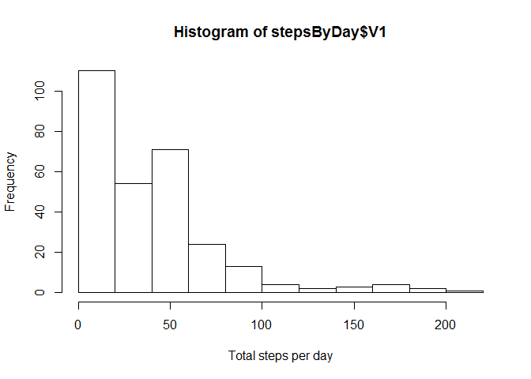
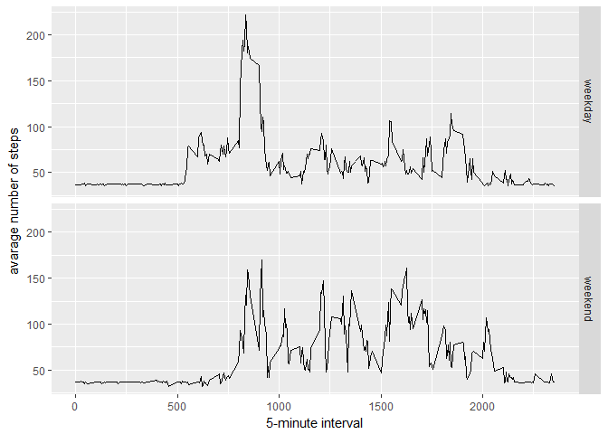

Loading and preprocessing the data
----------------------------------

``` r
#https://github.com/chrlad/RepData_PeerAssessment1
#https://github.com/blackdp1/RepData_PeerAssessment1
#https://github.com/Tianyu-Wang/RepData_PeerAssessment1
#https://github.com/keunmee/ReproResearchProjectWk2

library(RCurl)
library(ggplot2)
library(data.table)
library(Hmisc)

if (!file.exists("data")){
  dir.create("data")
  fileUrl <- "https://d396qusza40orc.cloudfront.net/repdata%2Fdata%2Factivity.zip"
  con <- download.file(fileUrl,destfile = "./data/activity.zip",method = "libcurl")
}

csvFile <- unz("./data/activity.zip","activity.csv")
act <- read.csv(csvFile, sep=",", header=T,colClasses = c("numeric","character","character"),stringsAsFactors = TRUE)
```

What is mean total number of steps taken per day?
-------------------------------------------------

``` r
DT <- data.table(act)
stepsByDay <- DT[,mean(steps,na.rm = TRUE),by=interval]
#stepsByDay <- DT[, j= list(sum(steps),mean(steps),median(steps)), by=interval]
hist(stepsByDay$V1,xlab = "Total steps per day")
```



``` r
#qplot(stepsByDay$V1, xlab='Total steps per day', ylab='Frequency using binwith 500', binwidth=500)
#mean(subset(act,act$steps>0)$steps,na.rm = TRUE)
#median(subset(act,act$steps>0)$steps,na.rm = TRUE)
mean(act$steps,na.rm = TRUE)
```

    ## [1] 37.3826

``` r
median(act$steps,na.rm = TRUE)
```

    ## [1] 0

What is the average daily activity pattern?
-------------------------------------------

``` r
p<-ggplot(data=stepsByDay, aes(x=as.integer(interval), y=V1)) +
  geom_line() +
    xlab("5-minute interval") + 
    ylab("avarage number of steps")
p
```


``` r
stepsByInterval <- DT[, mean(steps,na.rm = TRUE), by=interval]
stepsByInterval[stepsByInterval$V1==max(stepsByInterval$V1),]
```

    ##    interval       V1
    ## 1:      835 206.1698

Imputing missing values
-----------------------

``` r
sum(is.na(act$steps))
```

    ## [1] 2304

``` r
activityDataFilled <- act
activityDataFilled$steps <- impute(activityDataFilled$steps, fun=mean)
activityDataFilled$steps <- ifelse(activityDataFilled$steps>0,activityDataFilled$steps,mean(activityDataFilled$steps,na.rm = TRUE))

DT2 <- data.table(activityDataFilled)
stepsByDay2 <- DT2[, mean(steps), by=interval]

hist(stepsByDay2$V1,xlab = "Total steps per day")
```


``` r
mean(stepsByDay2$V1)
```

    ## [1] 60.81907

``` r
median(stepsByDay2$V1)
```

    ## [1] 55.52523

Are there differences in activity patterns between weekdays and weekends?
-------------------------------------------------------------------------


